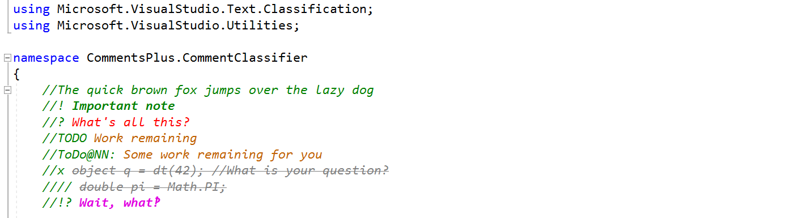

CommentsPlus
============

Formats code comments in *italics*, and enables extra formatting for special comments

By Mads Houmann

Based in part on code by Noah Richards and Tomas Restrepo.



Compile notes by @ZP-Z
----------------
-- build in Visual studio 2022, 
Install `Microsoft.VisualStudio.SDK 15.0.1` by NuGet:
1. Tools->Options->NuGet Package Manager->Package Sources:  
   add souce Name: NuGet, Source: https://api.nuget.org/v3/index.json
2. Tools->NuGet Package Manager->Package Manager Console:   
   `Install-Package Microsoft.VisualStudio.SDK -Version 15.0.1`
3. open `CommentsPlus-v17.sln` build in release or debug mode, install CommentsPlus17.vsix


Special Comments:
-----------------

```C#
//! Important - formatted as bold.
//? Question - colored red.
//x Removed - formatted as strikeout.
//TODO: Task - colored dark orange.
//TODO@NN: Task for NN - colored dark orange - case insensitive
//HACK: Task - colored dark orange.
//!? WT*!? - colored purple.
```

Supported File Types
--------------------

Should work with all or most VS supported source code file types.

Tested with: .cs, .vb, .h/.cpp, .py, .js, .ts, .ps1, .html, .xml, .xaml,

Settings
--------

The formatting can be changed in the Options dialog under Environment, Fonts and Colors, Text Editor.

Registry Settings
-----------------

HKCU\Software\CommentsPlus

* DWORD value EnableTags
* DWORD value EnableItalics
